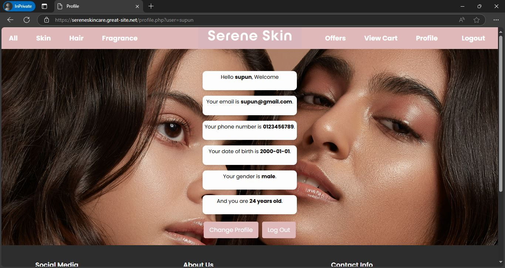

# Serene Skin Care

## Description
Serene Skin's website is developed using HTML, CSS, JavaScript, and PHP to create a smooth and efficient online shopping experience for skincare products. The front-end offers a responsive and easy-to-navigate design, while JavaScript is used for interactive elements and form validation to enhance user input accuracy. On the back-end, PHP manages SQL queries to handle product data, user accounts, and order management. This project integrates essential features like customer registration, login, and an intuitive checkout process, making it a complete e-commerce platform for skincare enthusiasts.

## Features
- Easy user registration
- Seamless login using username and password
- User friendly product catalog
- Product cart with add/remove and update functions
- Checkout page with products, quantities, delivery charges, taxes and total 
- Payment portal with the option to pay using saved card details and update saved card details

## URL🔗: https://sereneskincare.great-site.net

## Screenshots
### 1. Login Page

### 2. Register Page

### 3. Profile Page

### 4. Product Catalog

### 5. Product Page

### 6. Cart

### 7. Checkout Page

### 8. Payment Portal

